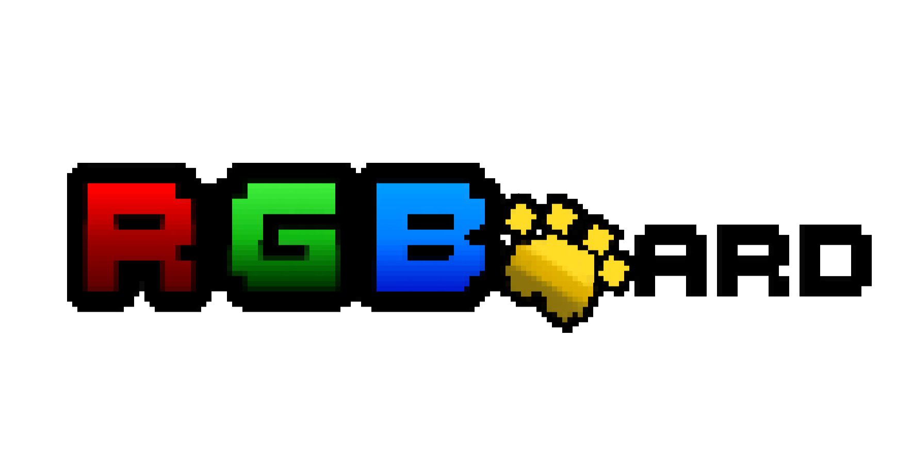

<link rel="stylesheet" href="custom.css">

  

## Team Members
- Marianyelis Jimenez Mercedes  (marianyelis.jimenez1@upr.edu)
- Irsaris Pérez Rodríguez  (irsaris.perez@upr.edu)
- Jandel Rodríguez Vázquez  (jandel.rodriguez@upr.edu)
- Edimar Valentín Kery  (edimar.valentin@upr.edu)

## Presentation
<a href="placeholder">View the fina presentation</a>

## Project Directory

### • Webapp
Web-based system using a Raspberry Pi-powered LED display to show dynamic visuals.

- [View Project](https://RGBOARD.github.io/webapp)
- [View Code](https://github.com/RGBOARD/webapp)

### • Display
Library used to control 64x64 RGB LED panels via Raspberry Pi GPIO.

- [View Project](https://RGBOARD.github.io/display)
- [View Code](https://github.com/RGBOARD/display)

#### About the project
This project is a dynamic, web-managed communication system designed for the IEEE Computer Society at the University of Puerto Rico, Mayagüez Campus (UPRM). 
It is part of the course INSO/CIIC 4151 of the Department of Computer Science and Engineering.
